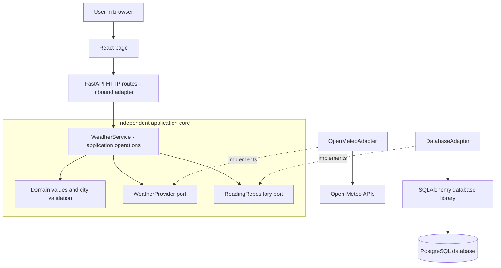
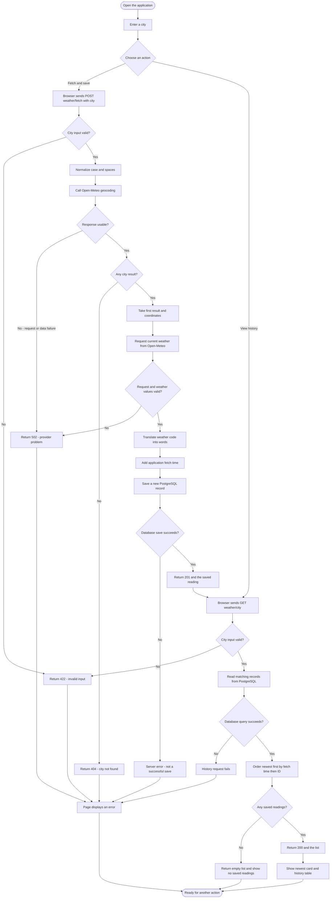
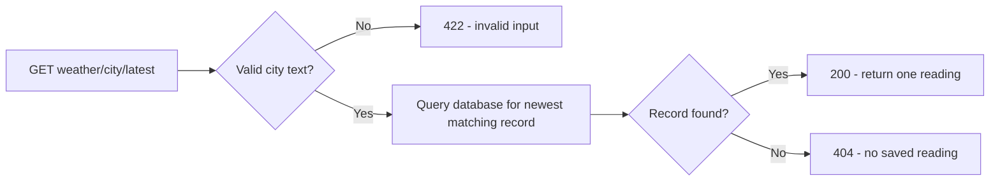
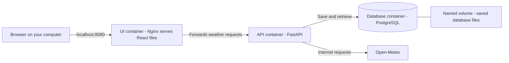
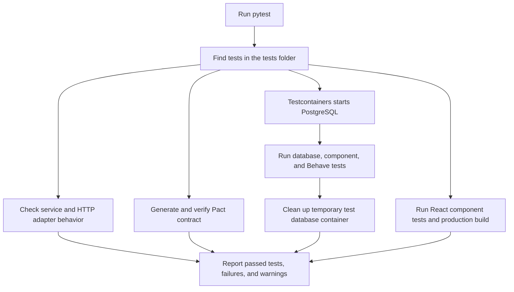

# Weather Aggregator — A Beginner's Guide

This guide explains **why this project exists, what it does, how its parts fit together, and what happens when you use it**. You do not need previous knowledge of Python, React, databases, or Docker.

The original `README.md` is the shorter guide for installation and commands. This file explains the ideas behind those commands.

## 1. What is this project?

Imagine keeping a weather notebook. You write a city's name, check its current weather, and record the result. Later, you open the notebook to see your earlier entries.

This application is that notebook in software:

1. You enter a city, such as **Bengaluru**.
2. The application asks **Open-Meteo**, an external weather service, for current conditions.
3. It saves the result in a **database**, an organized place for storing information.
4. You see the weather and can revisit the saved readings later.

A **reading** means one saved weather entry. An **aggregator** collects information and brings it into one place. Despite its name, this project uses one weather provider, Open-Meteo. It does not combine predictions from several providers or calculate its own weather forecast.

## 2. Why was the project created?

The project was created for a technical interview assignment. The assignment asks for more than a page that displays weather. It checks whether the developer can:

| Goal | What it means in simple words |
| --- | --- |
| Connect to an external service | Ask another system for information and understand its answer. |
| Store information | Keep readings after the request finishes so they can be retrieved later. |
| Build a usable interface | Let someone enter a city and see saved readings. |
| Separate responsibilities | Give each part of the code a clear job. |
| Handle failures | Show understandable errors when input is wrong or a weather request fails. |
| Prove the behavior with tests | Check success and failure cases automatically instead of relying only on manual clicking. |

The learning goal is to build a small application whose behavior is easy to explain, test, and change.

## 3. Problem statement

**We need a simple way to fetch current weather for a city, save each successful fetch, and retrieve the saved history or latest saved reading.**

Getting this right involves several smaller problems:

* People enter city names, but the weather service needs map coordinates.
* The provider returns a numeric weather code, which needs a readable description.
* Results must be saved, not just displayed temporarily.
* Saved readings must appear in the correct order.
* Invalid cities, unknown cities, and network failures must be handled.
* Weather-provider code and database code must not be mixed into the central application rules.

The application stores **history collected by this application**. It does not download historical weather. If you have never fetched a city, that city's saved history is empty.

## 4. Proposed solution and the implemented approach

The solution has three main parts:

| Part | Everyday meaning | Technology used here |
| --- | --- | --- |
| Frontend | The page you see and click | React |
| Backend | The program that receives requests and coordinates the work | Python with FastAPI |
| Database | The notebook that keeps the saved readings | PostgreSQL in Docker |

**Open-Meteo** is outside our application. Our backend calls it over the internet. The integration used here requires no API key in the project configuration.

**React** helps build the interactive page. **Python** is the programming language used for the backend. **FastAPI** is a framework: a collection of ready-made tools for building a web API.

An **API**, or Application Programming Interface, is a defined way for one program to talk to another. Here, the browser talks to our backend API, and our backend talks to Open-Meteo's API.

The browser does not connect directly to PostgreSQL or Open-Meteo. The backend controls those operations.

## 5. Functional requirements: what the project must do

A **functional requirement** describes a feature or behavior. It answers: **“What must the system do?”**

| ID | Requirement | Current behavior |
| --- | --- | --- |
| F1 | Accept a city name | The page contains a city input box. The backend also validates the input. |
| F2 | Find the city's location | Open-Meteo geocoding returns coordinates; the first result is used, as required by the assignment. |
| F3 | Fetch current weather | The backend reads only the `current_weather` section, not hourly or forecast data. |
| F4 | Translate weather codes | A lookup table converts codes into descriptions, such as `3` → `Overcast`. |
| F5 | Save each successful fetch | A new database record is created with the city, temperature, wind speed, description, and fetch time. |
| F6 | Return city history | All matching saved readings are returned, newest first. |
| F7 | Return the latest reading | A separate API endpoint returns the newest saved reading for a city. |
| F8 | Display results | The page shows the newest saved reading and a table of history. |
| F9 | Load history without fetching new weather | The **View history** button reads saved data only. |
| F10 | Handle invalid input and failed weather requests | The backend returns an error; a failed upstream fetch does not create a reading. |

**Geocoding** means turning a place name into coordinates. **Latitude** tells how far north or south a place is; **longitude** tells how far east or west it is.

There is no automatic background refresh. A successful click on **Fetch & save** adds a reading. Clicking it twice can save two readings with identical weather values but different fetch times.

## 6. Non-functional requirements: how the project should behave

A **non-functional requirement** describes a quality of the system. It answers: **“How well should it work, and what rules should its design follow?”**

The assignment explicitly requires the architecture and testing approach below. Other rows describe quality choices made in this implementation. They are not claims of production readiness.

| Quality | Meaning | How this project addresses it |
| --- | --- | --- |
| Maintainability | Code should be understandable and changeable | Weather requests, storage, HTTP handling, and application rules have separate files and responsibilities. |
| Framework independence | Central rules should not depend on a particular web or database tool | The domain and service use Python's standard library, without FastAPI, requests, or SQLAlchemy imports. |
| Testability | Each part should be testable on its own and with other parts | Unit, adapter, contract, database, component, BDD, and UI tests are included. |
| Persistence | Saved readings should survive application restarts | PostgreSQL stores data in a named Docker volume. Removing that volume would remove the stored data. |
| Predictable failure handling | Invalid input and provider problems should have clear outcomes | The API returns defined errors for invalid input, unknown cities, and provider failures. |
| Bounded network waiting | A weather request should not wait indefinitely for network activity | Each outgoing request has a 10-second requests-library timeout. This is not a guaranteed overall response-time limit. |
| Consistent data | Values and ordering should be predictable | Temperature uses °C, wind uses km/h, fetch times use UTC, and ties in time are ordered by record ID. |
| Repeatable setup | Other developers should be able to run the same components | Docker Compose describes the services; dependency lock files record package versions. |
| Basic usability | The page should make progress and errors visible | Buttons show loading state, duplicate clicks are disabled during a request, and errors appear on the page. |
| Local isolation | The demo should be reachable locally without publishing the database | Compose binds the UI and API to localhost; PostgreSQL has no host port published. |

**UTC** is a shared time standard. The backend records fetch time in UTC; the browser displays it in your local timezone.

There is no measured speed target, load-test result, or guaranteed uptime. Login, rate limiting, production secret management, and database migrations are not implemented. These would need separate work before a public production deployment.

## 7. Architecture: how the code is organized

**Architecture** means the overall arrangement of a system's parts and the rules for how they interact.

This project follows **Hexagonal Architecture**, also called **Ports and Adapters**. The name does not mean we need six services or six folders. The important idea is to keep the central application rules independent of outside tools.

Think of an electrical socket and a plug:

* A **port** describes the connection that is needed.
* An **adapter** connects a particular external tool to that connection.
* The central application uses the agreed connection without knowing the tool's internal details.

### 7.1 The central parts

The **domain** contains the important concepts: a weather reading, current conditions, city validation, and known error types. It also defines the two outbound ports.

The **service** coordinates a use case. A **use case** is one job the user wants done, such as “fetch and save weather.” `WeatherService` requests conditions, adds the fetch timestamp, and asks the repository to save the reading.

### 7.2 Ports and adapters in this project

| Name | Role | Plain-language explanation |
| --- | --- | --- |
| `WeatherService` | Application entry points | Offers the fetch, history, and latest operations. |
| `WeatherProvider` | Outbound port | Says: “Give me current conditions for this city.” |
| `OpenMeteoAdapter` | Outbound adapter | Fulfils that request by calling Open-Meteo over HTTP. |
| `ReadingRepository` | Outbound port | Says: “Save a reading, list readings, or get the latest one.” |
| `DatabaseAdapter` | Outbound adapter | Fulfils those requests with SQLAlchemy and the database. |
| FastAPI routes | Inbound adapter | Turns incoming web requests into service calls, then turns results into web responses. |

**Inbound** means a request coming into our application. **Outbound** means our application asking an outside tool for work. A **repository** is the part responsible for saving and retrieving records.

The ports use Python `Protocol` definitions: descriptions of the methods an implementation must provide. The service receives the actual adapters when the app starts. This is **dependency injection**: giving a component its helpers from outside, rather than making it construct those helpers itself.

### 7.3 Architecture diagram

Solid arrows below show the direction of calls. Dotted arrows show which adapter implements a port.



The service imports the port descriptions, not the adapter implementations. Replacing Open-Meteo with another provider would require an adapter that supplies the same `current` operation. The service could stay the same as long as the new adapter meets that contract.

The startup code that creates the service and connects its adapters is called the **composition root**. Here it is in `weather/api.py`. This file therefore has two jobs: application assembly and HTTP handling.

## 8. Full working flowchart

This diagram follows both buttons on the page, including important error paths. A **request** is a message asking for work; a **response** is the answer.



Before sending a request, the page blocks blank input and disables the buttons while busy. Backend validation is still necessary because other programs can call the API without using our page.

If the save succeeds but the following history request fails, the reading remains saved. The page specifically tells the user to retry **View history**. Provider failures are handled with a defined JSON error. Unexpected database failures currently result in a generic server error; there is no dedicated database-recovery screen.

If your Markdown viewer shows the diagram code instead of a picture, read the equivalent flow below. A Mermaid-capable Markdown viewer can render the diagrams. **Mermaid** is a text format for describing diagrams.

### 8.1 The same flow in everyday words

1. You type `Bengaluru` and click **Fetch & save**.
2. React asks our backend to fetch that city.
3. The backend checks the city text and normalizes spaces and letter case.
4. The weather adapter asks Open-Meteo where that city is.
5. It uses the first location result to request current weather.
6. It checks the response values and translates the weather code into words.
7. The service adds the time at which it fetched the result.
8. The database adapter saves the reading in PostgreSQL and returns its ID.
9. The backend confirms that the reading was created.
10. React makes a second request for the city's saved history.
11. The backend reads PostgreSQL and returns newest-first results.
12. React displays the first record in the newest-reading card and all records in the table.

The UI's newest-reading card uses the **first item of the history list**. It does not make a separate call to the `/latest` endpoint. That endpoint is available for API users and is tested separately.

### 8.2 Latest-reading API flow



History and latest requests do not call Open-Meteo. They can return previously saved readings even when the weather provider is unavailable, provided our backend and database are working.

## 9. Understanding the API without knowing programming

An **endpoint** is an address where an API offers an operation. **HTTP** is the communication protocol used for these web requests. **GET** asks to read data; **POST** submits a request that creates or changes something.

| Endpoint | What it asks the backend to do |
| --- | --- |
| `POST /weather/fetch?city=Bengaluru` | Get current weather and save a new reading. |
| `GET /weather/Bengaluru` | Return every saved reading for this city. |
| `GET /weather/Bengaluru/latest` | Return only the newest saved reading. |

In the first address, `city=Bengaluru` is a **query parameter**: extra information attached to the URL. In the other addresses, the city is part of the URL path.

The API returns **JSON**, a text format with named values. This is an illustrative response, not a live weather report:

```json
{
  "id": 1,
  "city": "Bengaluru",
  "temperature": 22.4,
  "wind_speed": 14.2,
  "description": "Overcast",
  "fetched_at": "2026-09-21T12:00:00+00:00"
}
```

| Field | Meaning |
| --- | --- |
| `id` | Unique number identifying this saved entry. |
| `city` | City name returned by the provider. |
| `temperature` | Temperature in degrees Celsius. |
| `wind_speed` | Wind speed in kilometres per hour. |
| `description` | Weather expressed in words. |
| `fetched_at` | When our application fetched the conditions, not when the provider measured them. |

The database also stores normalized city and query names to make lookups easier. For example, capital letters and extra surrounding spaces do not create a different search key. This is not a complete spelling-correction or city-alias system.

**HTTP status codes** summarize a request's outcome:

| Code | Meaning in this application |
| --- | --- |
| 200 | The read request succeeded. History can still be an empty list. |
| 201 | A new reading was successfully saved. |
| 404 | City not found during fetching, or no saved reading for a latest request. |
| 422 | Invalid input, such as a blank city. |
| 502 | The outside weather service failed, timed out, or returned invalid data. |
| 500 | An unexpected internal failure, such as an unhandled database error. |

## 10. Where Docker fits

**Docker** runs programs inside **containers**. A container is a packaged environment containing a program and the dependencies it needs. It is not a database itself.

**Docker Compose** starts related containers together using the instructions in `compose.yaml`.



**Nginx** is the web server that serves the built frontend files and forwards API requests to the backend. This forwarding is called a **proxy**.

A **volume** is storage managed separately from a container's temporary files. The `weather-data` volume keeps the app's PostgreSQL data between ordinary container restarts.

**localhost** means your own computer. A **network port**, such as `8080`, identifies the service to contact on that computer. A network port is different from an architecture port: one is a networking number; the other is an interface in the code.

| Address | Purpose |
| --- | --- |
| `http://localhost:8080` | The Docker-hosted application. |
| `http://localhost:8000/docs` | Interactive backend API documentation. |
| `http://localhost:5173` | The alternative Vite development frontend, only when started separately. |

Do not open `frontend/index.html` directly from disk. The source React app needs its development server or a built version served by Nginx.

On this Windows machine, **WSL 2**, Windows Subsystem for Linux, provides the Linux environment used by Docker Desktop. PostgreSQL Testcontainers tests need Docker running. Running the app through Compose is a convenient option; using real container infrastructure for the requested database tests is part of satisfying this assignment.

## 11. How testing proves the project works

A **test** runs some code, compares the result with an expected result, and reports success or failure. An **assertion** is the check that makes that comparison.

| Test type | Simple example | Tools |
| --- | --- | --- |
| Unit | If a provider returns conditions, does the service ask the repository to save the right reading? | pytest and mocks |
| Adapter | Does an invalid weather response become a provider error? | pytest and responses |
| Contract | Does the adapter send the agreed requests and accept the expected response structure? | Pact |
| Database integration | Can a real PostgreSQL database save, retrieve, and order readings? | Testcontainers and PostgreSQL |
| Component | Does an HTTP request travel through the application and save the correct data? | FastAPI TestClient, responses, PostgreSQL |
| BDD | Does a user-facing scenario behave as described in plain-language steps? | Behave and Gherkin |
| UI component | Does clicking Fetch & save display readings or an error correctly? | React Testing Library and Vitest |

A **mock** is a stand-in that can record how it was called. A **stub** provides controlled answers. Tests use these instead of the real weather provider so they can reliably test clear weather, unknown cities, and outages without waiting for real-world events.

**Pact** checks a contract: the agreed request and response structure. The consumer tests generate a Pact JSON file. A provider verifier replays it against an independent local stub server. This verifies our expected structure and test wiring; it does not prove that the real Open-Meteo service will never change.

**Testcontainers** starts a temporary real PostgreSQL container for tests. The combined run shares one container across the database, component, and BDD suites, resets the data between cases, and cleans up afterward. This test database is separate from the application's Compose database.

**BDD**, Behavior-Driven Development, describes behavior through examples. **Gherkin** is its readable scenario format:

```gherkin
Given current weather is available for "timisoara"
When I fetch weather for "timisoara"
Then the response status is 201
And "timisoara" has 1 stored reading
```

**TDD**, Test-Driven Development, means writing a failing test first, adding code to make it pass, then improving the code while keeping tests passing. This is often called **red → green → refactor**. Refactoring means improving code organization without changing its intended behavior. The service tests in this project were written and run before the service implementation.

### Test execution flow



These branches show groups of checks, not parallel execution. The current tests run serially because several suites share and reset the same test database.

The verified PostgreSQL run on September 21, 2026 reported **34 passed, 3 warnings in 94.37 seconds**. The 34 pytest items include a wrapper that runs four BDD scenarios and another wrapper that runs four React tests plus a frontend build. They are not 34 separate browser tests. The warnings were two testing-library deprecations and a local pytest cache permission warning.

**CI**, Continuous Integration, runs automated checks when code is pushed or changed. The project includes a GitHub Actions CI workflow. The workflow is prepared, but it has not run remotely because this repository has not yet been published to GitHub.

## 12. Try the project yourself

### Start the app

Open Docker Desktop and wait for its engine to start. Open the project folder in VS Code, choose **Terminal → New Terminal**, and run:

```powershell
docker compose up --build -d
```

`--build` builds the application images. An **image** is the packaged template used to create a container. `-d` keeps the containers running in the background.

Open `http://localhost:8080`, enter a city, and click **Fetch & save**. Fetch again to add another entry, then use **View history** to see the saved records.

### Run all tests

The commands below use the existing Python environment and installed frontend dependencies in this workspace. For a fresh checkout, complete the dependency setup in the original `README.md` first.

```powershell
Remove-Item Env:TEST_DATABASE_URL -ErrorAction SilentlyContinue
.\.venv\Scripts\python.exe -m pytest -v -s
```

The first command removes the optional SQLite test override from this terminal. This ensures the tests use PostgreSQL Testcontainers. `-v` shows individual test names; `-s` displays additional output such as the BDD steps and Pact verification.

`.venv` is a **virtual environment**: a separate set of Python packages for this project. It is different from a Docker container.

### Check and stop the app

```powershell
docker compose ps
docker compose logs --tail 50 api
docker compose down
```

The commands list container status, show recent backend messages, and stop/remove the app containers. The named database volume stays unless you explicitly remove it. Ordinary test runs do not erase the Compose application's saved readings.

## 13. A map of the source code

| File or folder | Read it to understand |
| --- | --- |
| `frontend/src/App.jsx` | City input, buttons, browser requests, and displaying history. |
| `frontend/src/style.css` | Colors, spacing, fonts, and page layout. |
| `weather/domain.py` | Reading data, errors, city normalization, and ports. |
| `weather/service.py` | Fetch, history, and latest application operations. |
| `weather/api.py` | API routes, error responses, and startup wiring. |
| `weather/adapters/open_meteo.py` | Calling Open-Meteo and interpreting its responses. |
| `weather/adapters/database.py` | Database table, saving, filtering, and ordering. |
| `tests/` | Automated checks and shared test infrastructure. |
| `features/` | Plain-language BDD scenarios and their Python steps. |
| `pacts/` | Generated Open-Meteo consumer contract. |
| `compose.yaml` | How the three application containers run together. |
| `Dockerfile` and `frontend/Dockerfile` | How backend and frontend images are built. |
| `.github/workflows/ci.yml` | Instructions for automated checks on GitHub. |
| `requirements.lock` and `frontend/package-lock.json` | Recorded dependency versions for repeatable installation. |

**SQL** is the language used to read and change relational database data. **SQLAlchemy** is the Python library this project uses to construct and execute database operations. A **transaction** groups database work so it can be completed or rolled back together; saving a reading uses a transaction.

An **index** helps a database find or order matching records efficiently. This project's indexes include city keys and timestamps. They support the lookup pattern, but they are not evidence of a measured performance guarantee.

## 14. Current limits and possible future improvements

| Current limit | Possible future improvement |
| --- | --- |
| The first city match may be a different place with the same name | Let users choose the city and country from a list. |
| History grows every time a fetch succeeds | Add pagination, meaning returning records in smaller pages. |
| No automatic refresh | Add scheduled fetches if a future requirement calls for them. |
| No user accounts | Add authentication, meaning checking who a user is, and authorization, meaning checking what they may do. |
| Database tables are created automatically but schema changes are not managed | Add migrations: versioned instructions for changing the database structure. |
| No recovery strategy for unexpected database outages | Add clearer failure responses, monitoring, and operational recovery procedures. |
| Only current weather is collected | Add forecasts only if the requirements change; they are intentionally outside this assignment. |

The project already demonstrates the requested core: a React interface, a separated backend design, real weather integration, persistent readings, and automated tests including PostgreSQL containers. These future ideas describe additional work, not features already implemented.
